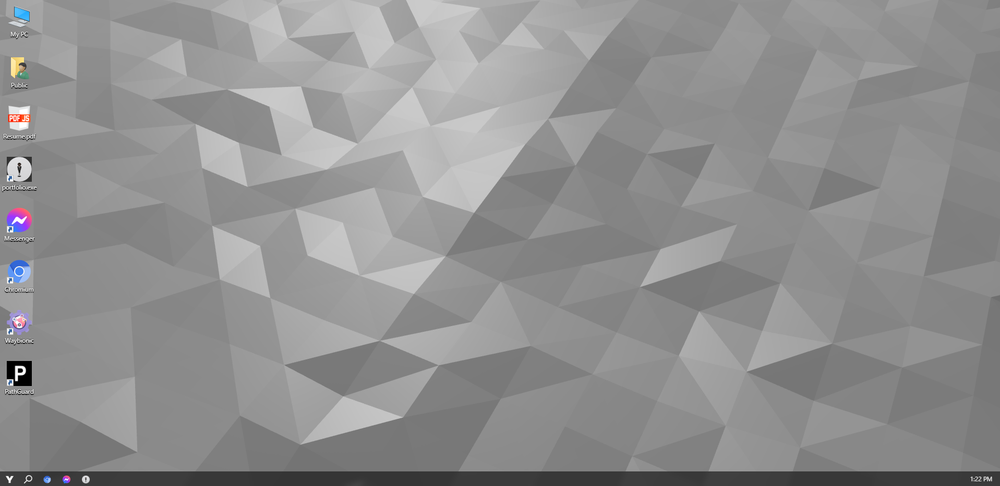

# yassinOS

A web-based “desktop OS” experience that powers the inner environment of my personal portfolio: **[yassin.app](https://yassin.app)**.

Live (when deployed): **os.yassin.app**

## Preview



---

## Overview

**yassinOS** is an interactive, browser-based OS-style UI (windows, apps, draggable/resizable panels, etc.). It is designed to be explored on a **computer** (mouse/keyboard).

---

## Tech Stack

- **Next.js / React**
- **TypeScript**
- **CSS / UI components** (project-specific)

---

## Getting Started (Local)

### Prerequisites

- **Node.js** (recommended: current LTS)
- **npm** (or your preferred package manager)

### Install dependencies

```bash
npm install
```

### Run the dev server

```bash
npm run dev
```

Then open the local URL shown in your terminal.

---

## Production Build

```bash
npm run build
npm run start
```

---

## Docker (Optional)

If your repo includes a Dockerfile, you can build and run locally like this:

```bash
docker build -t yassinos .
docker run --rm -p 3000:3000 yassinos
```

Then visit:

- `http://localhost:3000`

---

## Relationship to yassin.app

This repo is the **inner site** used by my portfolio’s outer layer:

- Outer site repo: **yassin.app** (the “computer/scene” layer)
- Inner site repo: **yassinOS** (this repo)

### Embedding

The room on yassin.app shows yassinOS on its main monitor (M1), a 1600 x 900 iframe:

```text
https://os.yassin.app/?embed=1&display=main&protocol=1&wallpaper=span&quality=high
```

| Param            | What it does                                                                                                           |
| ---------------- | ---------------------------------------------------------------------------------------------------------------------- |
| `embed=1`        | Embedded mode. The other params only count with it.                                                                    |
| `display=main`   | The room's main screen. The desktop starts with nothing open, the parent opens apps (`app=` and `url=` still work).    |
| `wallpaper=span` | M1's part of the room wallpaper that spans all three screens, whatever the visitor picked. No wallpaper worker starts. |
| `quality=low`    | An animated wallpaper, if one was picked, at half resolution and 30 fps (`high` is the default).                       |
| `protocol=1`     | The protocol the parent speaks. Informational: `yassinos:hello` and `yassinos:ready` carry the version that counts.    |

The room wallpaper is also yassinOS's default on its own (Background, Room): the whole design, covering the screen. A session saved earlier with the old default (Vanta Waves) switches to it once; any wallpaper picked after that stays.

The bridge (`utils/embedBridge.ts`, `hooks/useEmbedBridge.ts`) only runs with `embed=1` in a frame. Messages are plain objects with a `type`.

**Parent to yassinOS.** Only from `window.parent`, and only from `https://yassin.app` or `https://www.yassin.app` (plus `http://localhost:*`, `http://127.0.0.1:*` and `http://192.168.*` in development builds). After the first valid hello, only from that hello's origin.

| Type              | Payload                                                                    | Effect                                                                                                                                                                     |
| ----------------- | -------------------------------------------------------------------------- | -------------------------------------------------------------------------------------------------------------------------------------------------------------------------- |
| `yassinos:hello`  | `{ protocol: 1, display?: "main", size?: [w, h], tier?: "high" \| "low" }` | Pins the parent's origin. Answered with `ready` once the desktop has painted. Send it on load and repeat it until `ready` arrives.                                         |
| `yassinos:pause`  | none                                                                       | Stops the wallpaper worker and the taskbar clock's ticking.                                                                                                                |
| `yassinos:resume` | none                                                                       | Starts them again.                                                                                                                                                         |
| `yassinos:open`   | `{ app: string, url?: string }`                                            | Opens a process id from `contexts/process/directory.ts` the way `?app=` does. Unknown ids are ignored. If that app (with that url) is open already, it comes to the front. |

**yassinOS to parent.** Posted to the hello's origin, never to `*`.

| Type              | Payload                                               | When                                                                                                                                                         |
| ----------------- | ----------------------------------------------------- | ------------------------------------------------------------------------------------------------------------------------------------------------------------ |
| `yassinos:ready`  | `{ protocol: 1 }`                                     | After a hello, once the desktop, taskbar and icons have painted (and the span wallpaper is decoded). Again for every later hello.                            |
| `yassinos:state`  | `{ apps: string[], focused: string \| null }`         | Process ids only, debounced. After `ready`, then whenever windows open, close or change focus.                                                               |
| `yassinos:input`  | `{ kind: "keydown" \| "pointerdown" \| "pointerup" }` | No key values. A held key reports once, and each kind reports at most every 25 ms.                                                                           |
| `yassinos:escape` | none                                                  | An Escape nothing in yassinOS used: not in a text field, a dialog or an open menu, not in fullscreen or pointer lock, no modifiers, not prevented by an app. |

The room kit lives in `public/embed/` and is served with `Access-Control-Allow-Origin: *`:

- `room-theme.json`: colours, fonts, taskbar and window chrome, the terminal's look, and the three screens' rects (mm, 0..1 and px). `node scripts/roomSpan.js` builds it from `styles/defaultTheme`.
- `room-span.webp`: the wallpaper across all three screens, 3 px per mm. Same script.
- `poster-main.webp`: M1 with nothing open, for the parent to show until `ready`. `node scripts/embedPoster.js <url>` against `yarn dev` or a production build.

---

## Credits

- **Based on** [daedalOS](https://github.com/DustinBrett/daedalOS) by **Dustin Brett**: https://github.com/DustinBrett
- `LICENSE` keeps Copyright (c) 2025 Dustin Brett for that work, and Copyright (c) 2025 Yassin Soliman for the modifications. A cold load still boots daedalOS. `?shell=next` opens a separate sandboxed compositor with its own files. See `docs/shell.md`.

---

## Notes

- Best experienced on a **computer** (mouse + keyboard).
- If you find bugs or have ideas for improvements, feel free to open an issue or message me.
